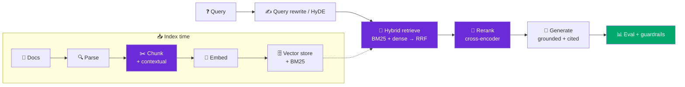

**The most complete, senior-level prep for RAG-engineer interviews — 100+ questions, worked system designs, and a typed resource hub, all dated 2026.**

*Maintained by [Landed](https://landed.jobs) — daily AI-native job matches, agent help with every application, and mock-interview prep.*

---

## What a RAG-engineer interview tests in 2026

A RAG interview is not a trivia quiz about vector databases. **It tests whether you treat retrieval as an information-retrieval system with real metrics and tradeoffs — or as a magic box.** By 2026 the loop is ~60% GenAI-focused, and "Design a RAG system for a customer-support chatbot" is reported across companies as the baseline system-design prompt. Interviewers probe seven things: can you *debug retrieval before generation*, define `recall@k` / `precision@k` / `nDCG`, choose chunking + hybrid + reranking deliberately, *evaluate* the pipeline (offline and online), ground answers with citations, size the thing (RAM / latency / cost) on a whiteboard, and secure it for real tenants. This repo gives you the mechanism first, then the production implication, for every one of those.

> ⭐ **Star this repo** — it's the deepest RAG interview-prep on GitHub, refreshed for 2026 (GraphRAG, agentic RAG, contextual retrieval, retrieval eval, secure/enterprise RAG).

---

## The RAG pipeline map — what gets tested at each stage

Every RAG interview walks some subset of this pipeline. This is the signature map: each stage, what the interviewer is actually probing, and where to prep it.

| Stage | What the interview tests | Prep |
|---|---|---|
| **Ingest / parse** | Parsing is stage zero — tables, scans, multi-column PDFs corrupt text *before* any chunker runs | [01-chunking](content/01-chunking.md) |
| **Chunk** | Size by metric (`precision@5`), match-unit ≠ read-unit, orphaned-chunk fix (late / contextual) | [01-chunking](content/01-chunking.md) |
| **Embed** | Domain-fit before size; dimension is a RAM bill (`N × dim × 4B`); representation shearing on swaps | [02-embeddings & vector DBs](content/02-embeddings-and-vector-dbs.md) |
| **Store** | ANN internals (HNSW `M`/`efSearch`), IVFPQ vs HNSW memory (~20×), managed vs self-host | [02-embeddings & vector DBs](content/02-embeddings-and-vector-dbs.md) |
| **Retrieve** | Hybrid BM25 + dense, RRF fusion, exact-token gotchas, when hybrid *isn't* worth it | [03-retrieval & hybrid search](content/03-retrieval-and-hybrid-search.md) |
| **Rerank** | Cross-encoder vs bi-encoder, two-stage retrieval, ColBERT, latency budget | [04-reranking & query rewriting](content/04-reranking-and-query-rewriting.md) |
| **Generate** | Grounding, citations/attribution, hallucination localization, structured output | [07-grounding, citations, hallucination](content/07-grounding-citations-hallucination.md) |
| **Eval** | `recall@k` / `MRR` / `nDCG`, faithfulness/groundedness, Ragas / DeepEval / TruLens, LLM-judge calibration | [05-RAG evaluation](content/05-rag-evaluation.md) |
| **Operate** | Latency/cost, semantic caching, silent freshness drift, CDC re-indexing | [08-production, latency & cost](content/08-production-latency-cost.md) |
| **Secure** | Retrieval-time ACLs, PII redaction, multi-tenant isolation, indirect prompt injection | [09-enterprise & secure RAG](content/09-enterprise-secure-rag.md) |

---

## Contents

- [**Question bank**](questions/) — 100+ tiered, topic-grouped questions with per-option explanations
  - [Retrieval & architecture](questions/retrieval.md) · [Embeddings & vector stores](questions/embeddings.md) · [Chunking](questions/chunking.md) · [Reranking & query rewriting](questions/reranking.md) · [Evaluation](questions/evaluation.md) · [Production, latency & cost](questions/production.md) · [Security & enterprise](questions/security.md)
- [**Content**](content/) — one mini-lecture per topic (senior voice, callouts, runnable code, typed resources)
  1. [Chunking & contextual retrieval](content/01-chunking.md)
  2. [Embeddings & vector databases](content/02-embeddings-and-vector-dbs.md)
  3. [Retrieval & hybrid search](content/03-retrieval-and-hybrid-search.md)
  4. [Reranking & query rewriting](content/04-reranking-and-query-rewriting.md)
  5. [RAG evaluation](content/05-rag-evaluation.md)
  6. [Advanced RAG (GraphRAG, agentic, contextual, multimodal)](content/06-advanced-rag.md)
  7. [Grounding, citations & hallucination](content/07-grounding-citations-hallucination.md)
  8. [Production, latency & cost](content/08-production-latency-cost.md)
  9. [Enterprise & secure RAG](content/09-enterprise-secure-rag.md)
- [**Answers**](answers/) — [the RAG system-design rubric](answers/rag-system-design-rubric.md) + [4 worked designs](answers/)
- [**Resources**](resources.md) — 50 typed, annotated, license-noted resources + 13 repos to mine
- [What's new (2026-07)](#whats-new-2026-07) · [FAQ](#faq) · [Contributing](#contributing)

---

## How to use this repo

1. **Skim the pipeline map above** — it's your mental model for every system-design round.
2. **Drill the [question bank](questions/)** by topic. Every question is multiple-choice with a *why* for each option — the wrong answers teach as much as the right one.
3. **Read the [content](content/) mini-lectures** for the mechanism behind each answer, then the interview angles + senior traps.
4. **Practice [worked designs](answers/)** against the [one reusable rubric](answers/rag-system-design-rubric.md). Say the requirements-clarifying questions out loud first.
5. **Bookmark [resources.md](resources.md)** — the canonical papers, docs, and repos, each annotated and license-noted.

> [!TIP]
> The single highest-signal move in a RAG interview: **when answers are wrong, localize before you fix.** Instrument the retrieval/generation boundary — *is the gold chunk in the retrieved set or not?* Retrieval miss → chunking / hybrid / ANN-params / reranker. Retrieved but ignored → grounding / prompt. This one reflex separates "read a blog" from "shipped one."

---

## What's new (2026-07)

Dated for the 2026 loop — most recent shifts first:

- **Contextual Retrieval is table stakes.** Anthropic's Sep-2024 technique (prepend an LLM-written context to each chunk before indexing) cut failed retrievals **~49%**, and **~67%** combined with reranking. Expect "the orphaned-chunk problem" as a chunking question. → [01-chunking](content/01-chunking.md)
- **Agentic RAG is the 2026 default for multi-step queries** — retrieve → reason → re-retrieve loops (Self-RAG, CRAG, LangGraph), at the cost of 4–7× latency and loop-stuck risk. Know when it's the *wrong* tool. → [06-advanced-rag](content/06-advanced-rag.md)
- **GraphRAG** (Microsoft, 34k★ MIT) for whole-corpus *sensemaking* — but 5–10× pricier to index and off-distribution for narrow lookups. Match technique to query distribution. → [06-advanced-rag](content/06-advanced-rag.md)
- **"Eval is the new system design."** Retrieval IR metrics (`recall@k`, `MRR`, `nDCG`) + generation metrics (faithfulness, context precision/recall) via Ragas / DeepEval / TruLens, with LLM-judge calibration (Cohen's κ). → [05-rag-evaluation](content/05-rag-evaluation.md)
- **Secure & enterprise RAG** moved from nice-to-have to a whole round: retrieval-time ACLs (pre/post-filter ReBAC), PII redaction (Presidio), multi-tenant isolation (pgvector + RLS + HNSW), and indirect prompt injection (OWASP **LLM01:2025**, EchoLeak **CVE-2025-32711**). → [09-enterprise-secure-rag](content/09-enterprise-secure-rag.md)

---

## FAQ

**What is a RAG Engineer vs an AI Engineer?**
A RAG Engineer is an AI Engineer who specializes in the *retrieval* half — chunking, embeddings, vector DBs, hybrid search, reranking, and retrieval evals — so that LLM answers are accurate and grounded. It carries roughly a **10–20% premium** over general AI engineering because getting answers *right* is harder than getting them fluent. Most AI Engineer loops now include a heavy RAG block, so this repo prepares both.

**What's the best vector database in 2026?**
There is no single "best" — it's a procurement decision. Benchmarks (mid-2026): **Qdrant** fastest (~30–40ms p50, 8–15k QPS), **Pinecone** best all-round balance (managed), **pgvector** when you already run Postgres and want multi-tenant RLS, **FAISS** for unmanaged max-throughput, **Milvus/Weaviate** for scale + hybrid. The senior answer names the *tradeoff axis* (managed vs self-host, memory vs recall, isolation, residency), not a brand. → [02-embeddings & vector DBs](content/02-embeddings-and-vector-dbs.md)

**How do you evaluate a RAG system?**
Two layers. **Retrieval** (IR metrics on a labelled set): `recall@k` (the ceiling — did the gold chunk make top-k?), `precision@k`, `MRR`, `nDCG`. **Generation**: faithfulness/groundedness (every claim entailed by context), answer relevancy, context precision/recall — via **Ragas / DeepEval / TruLens**, with the LLM judge *calibrated against human labels* (Cohen's κ) before it gates. Then split offline vs online (shadow/canary on production traffic). → [05-rag-evaluation](content/05-rag-evaluation.md)

**How do you reduce hallucinations in RAG?**
Most "hallucinations" are *retrieval misses* — the right chunk never made top-k, so no generator can recover it. Fix retrieval first (recall@k), then ground: instruct strict grounding, cite the chunk (generation-time or post-hoc), score faithfulness as an *online guardrail* that blocks or routes-to-human below an SLO, and validate the *retrieved-context channel* against injection. → [07-grounding, citations, hallucination](content/07-grounding-citations-hallucination.md)

**Do I need to fine-tune the model for RAG?**
Usually no. RAG decouples knowledge from weights: re-index for freshness, cite the chunk, filter by ACL — none of which fine-tuning gives you. Fine-tune only for *style/format* or a *fixed skill*, or an embedding model on your domain. For volatile, access-controlled facts, RAG wins. They compose; they don't compete.

---

## Contributing

PRs and issues welcome — add a real interview question (with a provenance label), a resource (typed + license-noted), or a worked design. See [CONTRIBUTING.md](CONTRIBUTING.md) for the quality spec. This is a living map of a fast-moving field; help keep it current and honest.

---

### Part of the Landed AI-native jobs family

Part of the [Landed](https://landed.jobs) AI-native job-search family:

- 🧭 [awesome-ai-native-jobs](https://github.com/landedjobs/awesome-ai-native-jobs) — the umbrella that maps the whole AI-native job landscape
- 🔥 [whos-hiring-in-ai](https://github.com/landedjobs/whos-hiring-in-ai) — real hiring posts from founders on X, sorted by role
- 💸 [recently-funded-ai-startups-hiring](https://github.com/landedjobs/recently-funded-ai-startups-hiring) — fresh-capital startups staffing up now
- 🚀 [ai-engineer-jobs](https://github.com/landedjobs/ai-engineer-jobs) — 300 live AI engineer roles, auto-updated
- 🤝 [forward-deployed-engineer-jobs](https://github.com/landedjobs/forward-deployed-engineer-jobs) — FDE & customer-facing engineering
- 📈 [gtm-engineer-jobs](https://github.com/landedjobs/gtm-engineer-jobs) — GTM engineering roles
- 🎓 [ai-fellowships-and-residencies](https://github.com/landedjobs/ai-fellowships-and-residencies) — 75 fellowships, residencies & programs
- 📘 [ai-interview-guides](https://github.com/landedjobs/ai-interview-guides) — 33 company interview guides
- ❓ [ai-interview-questions](https://github.com/landedjobs/ai-interview-questions) — 331 real interview questions with answers
- 🧪 [projects-to-land-an-ai-job](https://github.com/landedjobs/projects-to-land-an-ai-job) — portfolio projects that actually get you hired
- 🗺️ [ai-product-engineer-roadmap](https://github.com/landedjobs/ai-product-engineer-roadmap) — the AI product engineer roadmap
- 📦 [ai-engineer-portfolio-projects](https://github.com/landedjobs/ai-engineer-portfolio-projects) — 80+ buildable portfolio projects

---

### Stop spraying. Get **matched**, get **prepped**, get **Landed**.

Maintained by [Landed](https://landed.jobs) · No affiliation with the companies named. Content MIT-licensed. Real questions carry provenance labels; representative questions are marked 🔮.

